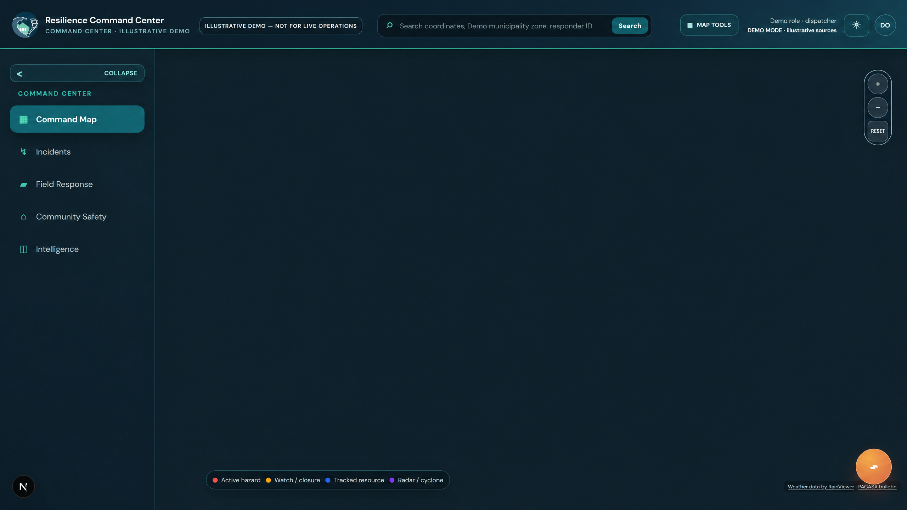

# Code for Resilience

> **A disaster-management platform foundation for decision support, resilient workflows, and explicitly bounded operations.**

Code for Resilience combines a FastAPI/PostGIS backend, a Next.js command-center dashboard, and a React Native/Expo resident application designed for intermittent connectivity, power loss, typhoons, storm surge, and flash-flood conditions. It is a development and pilot foundation—not a certified emergency-service deployment.

**[Documentation index](docs/INDEX.md)** · **[Architecture](docs/architecture.md)** · **[Portfolio Command Center](https://github.com/Jonnywik/Jonnywik.github.io)**

## Project signal

| System role | Source trace | Design focus |
| --- | --- | --- |
| Resilient public-service foundation | `backend/app` → `frontend` → `mobile` → `docs/architecture.md` | Decision support, offline-aware workflows, and clear limits on automated action. |

## Animated interface preview


> **Sanitized demo-mode preview.** This animation is generated from the authentic product interface with neutral demo labels. It contains no real municipality, operator, incident, location, coordinate, credential, or live emergency data, and it does not represent a live operations system.

## Static interface reference



> The full-resolution reference frame preserves the same demo-mode and non-live-operations boundary.

### Refreshing the preview

The animation is rebuilt only from `docs/assets/command-center-demo.png`, which must remain a **sanitized demo-mode** capture. Run `pnpm preview:refresh` from `frontend`, or open **Actions → Refresh sanitized README preview → Run workflow**. The workflow uploads the rebuilt GIF as an artifact by default; select **Commit the rebuilt GIF** only after reviewing the source capture and confirming it contains no live, local, or sensitive operational context.

## Implemented in this iteration

The repository now contains a runnable FastAPI service with demo mode, dashboard summary APIs, verified alert and evacuation-center APIs, internet SOS intake, signed SMS SOS decoding, safe-route lookup, WebSocket event fan-out, and dispatcher status transitions. The Next.js dashboard renders the command-center information architecture and is connected to those endpoints. The Expo mobile app includes a durable local snapshot, an SOS outbox, connectivity monitoring, offline emergency toolkit screens, evacuation-center browsing, location capture, internet SOS submission, and SMS handoff.

The demo mode is intentional. It allows the dashboard and mobile client to be developed and reviewed without a running PostgreSQL/PostGIS container or imported municipal GIS layers. Set `DEMO_MODE=false` only after the database, data imports, migrations, and authentication are ready.

## Interface preview


> **Sanitized demo-mode capture.** This image uses neutral demo labels and contains no real municipality, operator, incident, location, coordinate, credential, or live emergency data. The interface is a development and pilot foundation; it is not a live emergency-service deployment.

## Current Command Center capabilities

The LGU dashboard provides nine operational workspaces: Overview, Live SOS, Verified Alerts, Provincial Weather, Risk Map, Evacuation Centers, Resources, Response Groups, and Communications. Current decision-support additions include PAGASA weather and tropical-cyclone context, RainViewer radar display, static Project NOAH hazard references, operator-triggered high-flood-risk assessment, and explainable responder-safety assessment for verified SOS incidents.

These features support decisions; they do **not** automatically issue public alerts, evacuation orders, responder dispatches, route clearances, or declarations. Source freshness, local applicability, field confirmation, and the LGU's adopted approval process remain mandatory. Project NOAH references are static hazard context, not live flood, road-passability, or evacuation-safety evidence.

## Repository structure

| Path | Responsibility |
| --- | --- |
| `backend/app` | FastAPI service, API routes, database dependency, SOS codec, routing, and realtime event hub |
| `backend/tests` | Codec and demo API tests |
| `db/001_init.sql` | PostGIS schema for users, hazards, evacuation centers, roads, alerts, and SOS requests |
| `frontend` | Next.js LGU command-center dashboard |
| `mobile` | Expo React Native resident application |
| `mobile/harborline-web` | Harborline mobile-first civilian web companion for Balangiga, Eastern Samar |
| `docs/architecture.md` | Approved architecture, spatial model, API contracts, UX tree, and bottleneck analysis |
| `docs/ui-verification.md` | Local browser verification notes for the dashboard and SOS drawer |
| `docs/COMMAND_CENTER_NON_TECHNICAL_GUIDE.md` | Plain-language Command Center operator guide |
| `docs/LGU_DRRMO_ALERT_VERIFICATION_SOP_TEMPLATE.md` | Editable LGU DRRMO alert-verification SOP template |
| `docs/RESPONDER_SAFETY_ASSESSMENT_RULES.md` | Responder-safety assessment method and safeguards |
| `docker-compose.yml` | Local PostGIS service definition |

## Local development

### Backend

```bash
cd backend
python3 -m venv .venv
source .venv/bin/activate
pip install -r requirements.txt
cp .env.example .env
uvicorn app.main:app --reload --port 8000
```

The development configuration defaults to `DEMO_MODE=true`, so these endpoints work without PostGIS:

```text
GET  http://localhost:8000/v1/health
GET  http://localhost:8000/v1/dashboard/summary
GET  http://localhost:8000/v1/alerts
GET  http://localhost:8000/v1/evacuation-centers
GET  http://localhost:8000/v1/routes/safest-center?latitude=11.1264&longitude=125.3892
POST http://localhost:8000/v1/sos
PATCH http://localhost:8000/v1/sos/{id}/status
WS   ws://localhost:8000/v1/ws/lgu
```

Run backend tests from the repository root:

```bash
python3 -m pytest -q backend/tests
```

### LGU dashboard

```bash
cd frontend
pnpm install
NEXT_PUBLIC_API_BASE_URL=http://localhost:8000/v1 pnpm dev
```

Open `http://localhost:3000`. The dashboard includes a responsive command-center layout, map-style risk overlays, open-center capacity cards, verified alerts, an SOS queue, and a triage drawer that updates incident state through the backend.

### Resident mobile app

Install Expo dependencies and start the development client:

```bash
cd mobile
pnpm install
EXPO_PUBLIC_API_BASE_URL=http://localhost:8000/v1 pnpm start
```

The resident flow is organized as **Alert → Map → Evacuate → SOS**. The local snapshot and SOS outbox remain available when `NetInfo` reports that the device is offline. Configure `EXPO_PUBLIC_LGU_SMS_NUMBER` with the verified official LGU emergency gateway number before enabling SMS handoff; the app refuses to send to an unconfigured destination.

## PostGIS mode

The included Compose file defines PostGIS and mounts `db/001_init.sql` into the container initialization directory:

```bash
docker compose up -d postgis
```

Then set `DEMO_MODE=false` and ensure `DATABASE_URL` points to the running service. The schema expects PostGIS and pgcrypto. Municipal hazard polygons, evacuation centers, and routable roads must be imported and validated before enabling live routing.

## Production hardening before field deployment

The current implementation is a foundation rather than a complete emergency-service deployment. The SMS gateway signature secret must be stored in a secret manager, and the gateway adapter must be verified against the provider's actual signed envelope. The single-process in-memory WebSocket hub must be replaced by durable pub/sub such as Redis Streams or NATS. Authentication, LGU role-based access control, audit logs, rate limiting, migrations, backups, device registration, alert source verification, observability, and disaster-recovery procedures are required before operational use.

The routing service should be benchmarked against the final road network and hazard layers, while local officials should validate every evacuation-center record, hotline number, hazard polygon, and offline toolkit entry. SMS payloads should be tested across the exact gateway and carrier path used in Eastern Samar, including delayed, duplicated, truncated, and reordered messages.

## Production extension baseline

The current implementation also includes signed demo sessions, role-aware SOS triage, audit-event review, normalized alert ingestion, feed-health reporting, a controlled external-feed polling adapter, and the mobile `GET /v1/sync/bootstrap` contract. Apply `db/002_operational_controls.sql` and `db/003_alert_sync.sql` after the original migration when moving from demo mode to PostGIS.

For approved external sources, configure `ALERT_FEED_URL`, `ALERT_FEED_SOURCE_NAME`, `ALERT_FEED_TIMEOUT_SECONDS`, and `ALERT_STALE_AFTER_SECONDS`. The polling adapter expects a provider-specific adapter to normalize source records into the direct alert shape; it intentionally does not scrape arbitrary webpage markup. See `docs/external-feed-findings.md` and `docs/production-extension.md` for source-boundary notes and operational contracts.

The dashboard now signs in a dispatcher session at startup and displays feed-health states. The mobile app persists a server cursor, refreshes through the unified bootstrap endpoint, and retries queued or failed internet SOS requests after reconnection. SMS remains the offline fallback.

## Final stabilization status

The final stabilization pass corrected live demo metrics, enforced a shared SOS transition state machine, persisted PostGIS SOS status events, fixed the alert feed-health runtime path, rejected mixed-source alert batches, removed the hard-coded mobile SMS destination, fixed the mobile SMS payload call, and added fail-fast validation for placeholder production secrets and wildcard production CORS.

Validation completed for this release includes 17 backend tests, Python compilation, a successful Next.js production build, a successful Expo TypeScript check, and an end-to-end demo smoke test covering health, feed health, bootstrap synchronization, signed dispatcher login, protected SOS triage, and the intentional demo-mode feed-poll guard.

The project is complete as a development and pilot foundation. It is not yet a certified emergency-service deployment: production still requires approved secret storage and rotation, real SMS-provider signature verification, a durable multi-instance event bus, PostGIS migration execution, authenticated user provisioning, verified GIS and hotline data, carrier testing, observability, backups, and disaster-recovery exercises.
