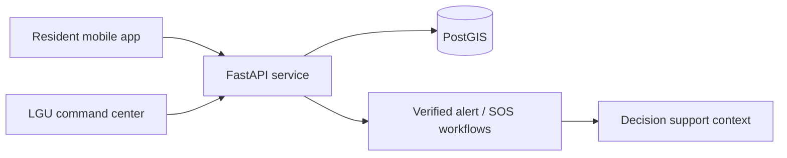

# Code for Resilience documentation index

This is the shortest route through the project. Start with the overview below, then follow the branch that matches your role or question.

## Start here

| If you need to understand… | Read this next |
| --- | --- |
| The project purpose, capabilities, demo mode, and local setup | [Repository README](../README.md) |
| Architecture, spatial model, API boundaries, and UX structure | [Architecture](architecture.md) |
| How a non-technical operator uses the command center | [Command Center guide](COMMAND_CENTER_NON_TECHNICAL_GUIDE.md) |
| The alert-verification operating procedure template | [LGU DRRMO alert verification SOP](LGU_DRRMO_ALERT_VERIFICATION_SOP_TEMPLATE.md) |
| The safety assessment approach and limits | [Responder safety assessment rules](RESPONDER_SAFETY_ASSESSMENT_RULES.md) |
| Deployment prerequisites and release gates | [Production deployment prerequisites](PRODUCTION_DEPLOYMENT_INFRASTRUCTURE_PREREQUISITES.md) and [release gate runbook](PRODUCTION_RELEASE_GATE_RUNBOOK.md) |

## System map

## Operational boundary

The project is a development and pilot foundation. It supports decision-making and workflow design; it does **not** automatically issue public alerts, evacuation orders, responder dispatches, route clearances, or emergency declarations. Real deployment requires verified local data, approved operating procedures, authentication and role management, monitoring, backups, and disaster-recovery preparation.

## Reading historical validation notes

The repository includes detailed validation and iteration notes in `docs/`. They are retained as engineering history. For an up-to-date entry point, use this index, the README, the architecture material, and the release/deployment documentation first.
